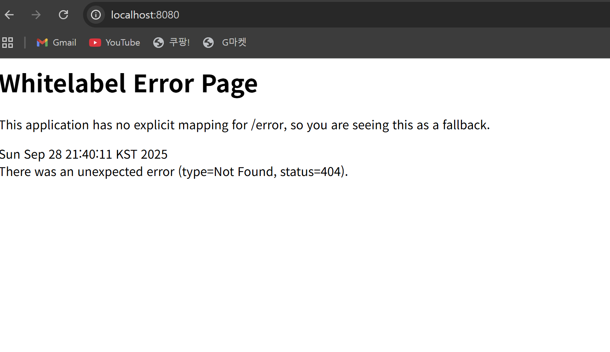

웹은 인터넷 위에서 동작하는 대표적 서비스로, 전 세계 컴퓨터와 기기를 연결하여 정보를 주고받게 한다. 클라이언트가 요청을 보내고 서버가 응답을 반환하는 구조를 가진다. 이때 URL은 특정 자원의 위치를 나타내며, 통신 규칙,, 포트, 경로, 쿼리 서버주소, 파라미터 등으로 구성된다. HTTP는 무상태성과 비연결성을 특징으로 하며, 매 요청은 독립적으로 처리된다. 주요 메서드로는 조회를 위한 GET, 등록을 위한 POST, 수정에 사용하는 PUT과 PATCH, 삭제를 위한 DELETE 등이 있다. 상태 코드는 200 OK, 201 Created, 400 Bad Request, 404 Not Found, 500 Internal Server Error 등으로 요청 처리 결과를 나타낸다. 웹 발전과 함께 프론트엔드와 백엔드의 역할도 분리되었다. 프론트엔드는 사용자가 직접 보고 상호작용하는 UI를 담당하며, 화면의 뼈대를 재사용하고 서버에서 필요한 데이터만 받아 갱신한다. 반면 백엔드는 사용자의 요청을 실제로 처리하고 데이터를 관리·저장하는 역할을 한다. 데이터는 DBMS를 통해 중복을 줄이고 무결성을 유지하며 안전하게 보관된다. 예를 들어, 사용자가 게시판 글 조회를 요청하면 프론트엔드는 화면을 구성하고, 백엔드는 데이터베이스에서 글 정보를 가져와 JSON 형태로 반환한다. 게시글 작성 시에도 클라이언트가 POST 요청을 보내면 백엔드가 데이터를 저장하고, 응답으로 201 Created를 반환하여 성공 여부를 알려준다. 
 REST API는 자원을 URI로 구분하고, Method로 조작하며, JSON과 같은 표현 형식으로 데이터를 주고받는 원칙을 따른다. 또한 스프링 프레임워크는 백엔드 개발을 체계적으로 지원하며, 스프링 부트는 복잡한 설정을 단순화하여 초보자도 빠르고 안정적으로 서버 애플리케이션을 개발할 수 있도록 돕는 강력한 도구다. 이번 학습에서는 웹과 HTTP의 기본 구조, REST API의 개념, 그리고 스프링 부트 환경 설정 및 실행 방법을 익히고, 이를 바탕으로 온라인 쇼핑몰 프로젝트를 위한 API 명세서를 작성하는 실습을 진행했다.

